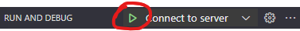

# Faladev - Integração com Google Calendar e Envio de Emails

Este projeto é uma aplicação Go que integra com o Google Calendar e tem permissão para enviar emails.

## Pré-requisitos

- Go versão 1.21 ou superior
- Conta no Google Console para criar credenciais de API

## Instalação

1. **Clone o Repositório:**

   ```bash
   git clone https://github.com/dedevpradev/faladev.git
   cd faladev
   ```

2. **Instale o Go:**

   Certifique-se de ter o Go instalado na versão 1.21 ou superior. Você pode verificar sua versão do Go com o comando:

   ```bash
   go version
   ```

   Para instalar ou atualizar o Go, siga as instruções oficiais: [Instalação do Go](https://golang.org/doc/install)

3. **Configurar Credenciais do Google Console:**

   Para que a aplicação possa acessar o Google Calendar e enviar emails, você precisa configurar as credenciais no Google Console:

   Acesse o Google Cloud Console: [Google Cloud Console](https://console.cloud.google.com/)

   Crie um Novo Projeto:

   - Vá para o painel do Google Cloud Console.
   - Clique em "Select a Project" e depois em "New Project".
   - Dê um nome ao seu projeto e clique em "Create".

   Habilite as APIs Necessárias:

   - Vá para "API & Services" > "Library".
   - Pesquise e habilite a API do Google Calendar.
   - Pesquise e habilite a API do Gmail.

   Configure a Tela de Consentimento OAuth:

   - Vá para "API & Services" > "OAuth consent screen".
   - Escolha "External" e clique em "Create".
   - Preencha as informações necessárias, como nome do aplicativo e email de suporte.
   - Adicione o escopo .../auth/calendar para acesso ao Google Calendar e .../auth/gmail.send para enviar emails.
   - Salve as alterações.

   Crie Credenciais OAuth 2.0:

   - Vá para "API & Services" > "Credentials".
   - Clique em "Create Credentials" e selecione "OAuth 2.0 Client IDs".
   - Escolha "Web application".
   - Adicione os URIs de redirecionamento autorizados. Exemplo: http://localhost:8080/callback
   - Salve as credenciais e anote o Client ID e Client Secret.

4. **Configurar Variáveis de Ambiente:**

   Crie um arquivo .env na raiz do projeto e adicione as seguintes variáveis, incluindo suas credenciais do Google:

   ```env
   GOOGLE_MEET_EVENT=https://meet.google.com/link-do-meet-do-evento
   GOOGLE_REDIRECT_URL=http://localhost:8080/callback
   GOOGLE_CLIENT_ID=seu-client-id
   GOOGLE_CLIENT_SECRET=seu-client-secret
   DATABASE_URL=sua-string-de-conexao-postgresql
   ```

5. **Instalar Dependências:**

   Execute o comando abaixo para instalar as dependências do projeto:

   ```bash
   go mod tidy
   ```

6. **Rodar o Projeto:**

   Para iniciar a aplicação, execute o comando:

   ```bash
   go run cmd/api/main.go
   ```
   Na primeira vez que você rodar o projeto, você deverá acessar o link será gerado no console para autorizar o seu aplicativo na sua conta Google.

## Instruções para com Docker

   Para iniciar a aplicação, execute o comando:

   ```bash
   docker-compose up -d
   ```

   Para parar e remover contêineres, redes, volumes e imagens usadas pelo docker compose, execute o comando:

   ```bash
   docker-compose down --rmi all
   ```

   Para limpar caches e configurações locais, você pode remover os arquivos de configuração e imagens desnecessárias:

   ```bash
   docker system prune -a --volumes
   ```

## Como usar o Debugger do VScode com Docker?

Tendo iniciado a aplicação com o comando do `docker compose` basta navegar até a aba `Run and Debug` do VSCode.

O comando padrão para acessar essa aba é `Ctrl+Shift+D` ou no Mac `Cmd+Shift+D`. Caso não seja o seu comando padrão você pode se basear [nessa](https://code.visualstudio.com/Docs/editor/debugging) documentação oficial.

Selecione a opção `Connect to server` e clique no botão de Play.


## Como Usar

   Para acessar a aplicação:

   ```bash
   http://localhost:8080
   ```

   Para acessar o Jaeger:

   ```bash
   http://localhost:16686/
   ```

   Para acessar o pgAdmin:

   ```bash
   http://localhost:5050/
   ```

